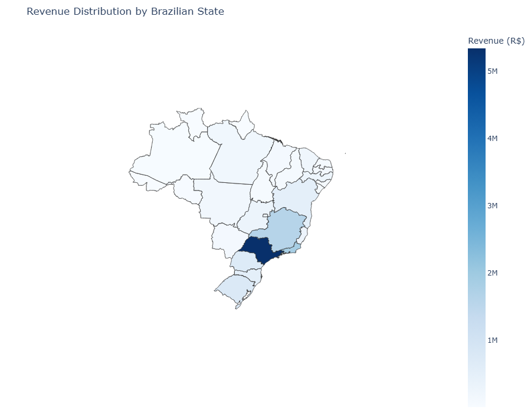
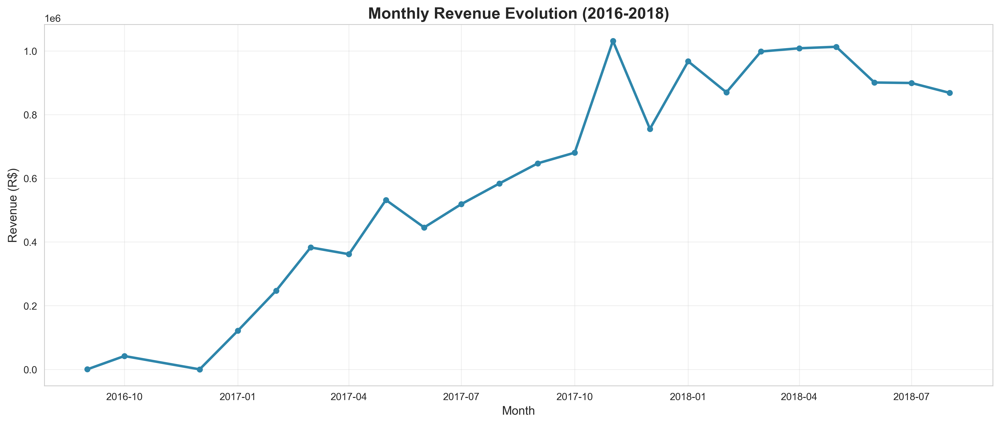
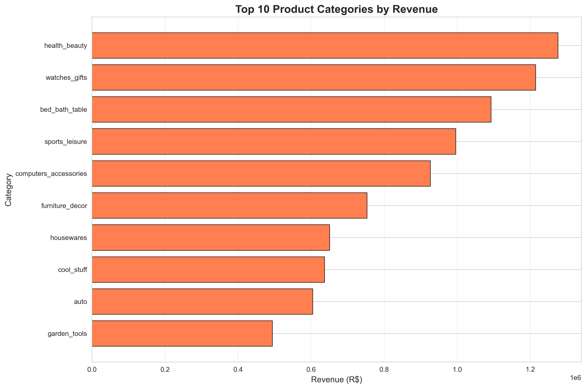
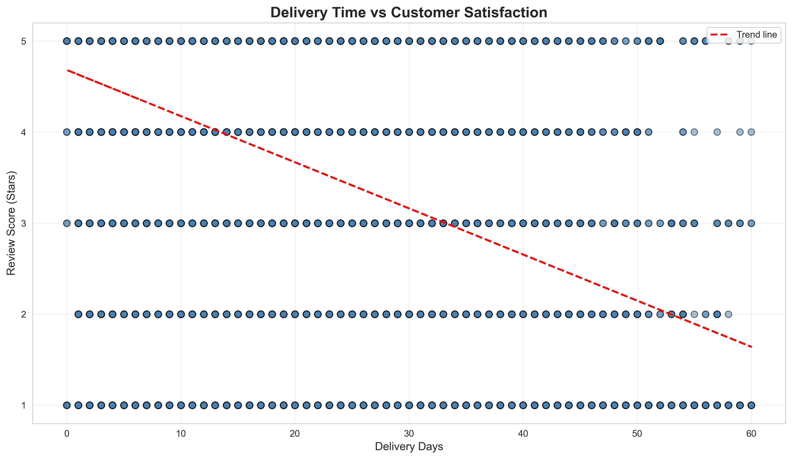
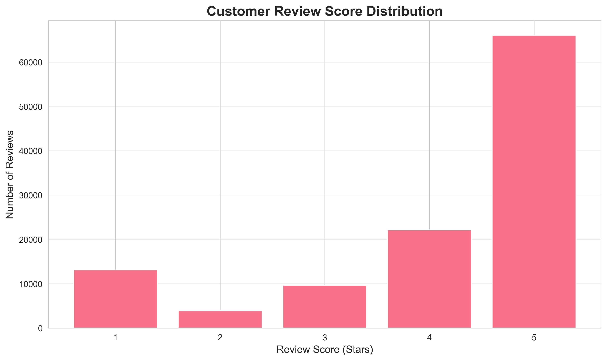

# 🛒 Brazilian E-Commerce Analysis - Olist Dataset

**A comprehensive data analysis project exploring sales performance, customer behavior, and logistics quality in the Brazilian e-commerce market.**

---

## 📊 Project Overview

This project analyzes the **Olist Brazilian E-Commerce Public Dataset** (100K+ orders from 2016-2018) to extract actionable business insights for strategic decision-making.

**Key Focus Areas:**
- Commercial performance trends and growth patterns
- Product category performance and market share
- Geographic distribution across Brazilian states
- Delivery quality and regional logistics disparities
- Customer satisfaction drivers and correlations

---

## 🎯 Business Questions Answered

1. **How has revenue evolved over time?** Analysis of monthly trends, growth phases, and plateaus
2. **Which product categories drive the most revenue?** Top performers and market concentration
3. **Where are our strongest markets geographically?** State-level and city-level performance
4. **What is our delivery performance?** Average delays, regional disparities, and outliers
5. **How satisfied are customers?** Review distribution and correlation with delivery times

---

## 🛠️ Technologies & Tools

**Languages:**
- Python 3.11

**Libraries:**
- **Data Manipulation:** Pandas, NumPy
- **Visualization:** Matplotlib, Seaborn, Plotly
- **Statistical Analysis:** SciPy

**Environment:**
- Jupyter Notebook
- Anaconda

---

## 📁 Project Structure

```
olist-ecommerce-analysis/
├── data/                          # Raw CSV files (not included in repo)
├── notebooks/
│   └── Olist_Analysis.ipynb       # Main analysis notebook
├── images/                        # Exported visualizations
│   ├── monthly_revenue.png
│   ├── top_categories.png
│   ├── brazil_choropleth.png
│   └── ...
└── README.md                      # Project documentation
```

---

## 📈 Key Findings

### 1. Commercial Performance
- **Revenue growth:** 2400% increase from Oct 2016 to Oct 2017 (marketplace launch phase)
- **2018 plateau:** Stabilization around R$1M/month followed by decline in Q3 2018
- **Average basket trend:** Declining from R$157 → R$142 (-9%), suggesting volume-over-value strategy

### 2. Product Categories
- **Health & Beauty** leads with 9.3% market share (R$1.28M)
- **Top 5 categories** represent 40% of total revenue
- **Long-tail distribution:** 60% revenue from categories outside top 5 (marketplace diversification)

### 3. Geographic Insights
- **São Paulo dominance:** 38% of national revenue (R$5.34M)
- **Southeast concentration:** SP + RJ + MG = 63% of total revenue
- **North region underserved:** Significant expansion opportunity

### 4. Delivery Quality
- **Average delivery time:** 12 days (acceptable)
- **70% delivered** within 15 days
- **Regional disparities:** Southeast 10 days median vs. North 25 days median
- **Outliers:** 5% of orders exceed 30 days (up to 209 days - critical issue)

### 5. Customer Satisfaction
- **Average rating:** 4.08/5 stars
- **77% positive reviews** (4-5 stars)
- **Correlation:** -0.31 between delivery time and satisfaction (moderate negative)
- **11% very dissatisfied** (1-star reviews) - improvement opportunity

---

## 🗺️ Interactive Visualizations

### Brazil Revenue Distribution (Choropleth Map)
Interactive map showing revenue concentration across Brazilian states, highlighting Southeast dominance and North/Northeast expansion opportunities.

**Technologies:** Plotly, GeoJSON


---

## 📊 Sample Visualizations

### Monthly Revenue Evolution (2016-2018)


### Top 10 Product Categories


### Delivery Times by Region


### Customer Satisfaction Distribution


---

## 🚀 How to Run

### Prerequisites
```bash
pip install pandas numpy matplotlib seaborn plotly requests
```

### Steps
1. **Clone the repository:**
   ```bash
   git clone https://github.com/yourusername/olist-ecommerce-analysis.git
   cd olist-ecommerce-analysis
   ```

2. **Download the dataset:**
   - Visit [Kaggle - Brazilian E-Commerce Dataset](https://www.kaggle.com/datasets/olistbr/brazilian-ecommerce)
   - Download and extract CSV files to `data/` folder

3. **Launch Jupyter Notebook:**
   ```bash
   jupyter notebook notebooks/Olist_Analysis.ipynb
   ```

4. **Run all cells** to reproduce the analysis

---

## 📌 Dataset Information

**Source:** [Kaggle - Olist Brazilian E-Commerce](https://www.kaggle.com/datasets/olistbr/brazilian-ecommerce)

**Period:** September 2016 - August 2018

**Size:** 
- 99,441 orders
- 32,951 products
- 99,224 customer reviews

**Tables Used:**
- `olist_orders_dataset.csv`
- `olist_order_items_dataset.csv`
- `olist_order_payments_dataset.csv`
- `olist_customers_dataset.csv`
- `olist_products_dataset.csv`
- `olist_order_reviews_dataset.csv`
- `product_category_name_translation.csv`

---

## ⚠️ Dataset Limitations

**Customer Retention Analysis:**
The dataset shows 0% repeat purchase rate due to Kaggle's anonymization process, which broke the link between orders from the same customer. In a real business context, customer lifetime value (CLV) and churn analysis would be critical priorities.

---

## 🎯 Business Recommendations

### Priority 1: Address Delivery Outliers
- **Action:** Investigate 5% of orders with >30 days delivery
- **Impact:** Reduce 1-star reviews (currently 11%)

### Priority 2: Geographic Expansion
- **Action:** Pilot expansion in Bahia and Pernambuco (high population, low penetration)
- **Impact:** Diversify revenue beyond Southeast concentration

### Priority 3: Increase Average Basket
- **Action:** Implement cross-selling, product bundles, free shipping threshold
- **Impact:** Reverse -9% basket decline trend

### Priority 4: Optimize North Logistics
- **Action:** Regional fulfillment partnerships to reduce 25-day median delivery
- **Impact:** Improve satisfaction and enable market growth

---

## 📚 Skills Demonstrated

- **Data Wrangling:** Merging 7+ datasets, handling missing values, date parsing
- **Exploratory Data Analysis:** Distribution analysis, outlier detection, correlation studies
- **Statistical Analysis:** Correlation coefficients, trend lines, comparative statistics
- **Data Visualization:** 12 professional visualizations including interactive choropleth maps
- **Business Intelligence:** Translating data insights into actionable recommendations
- **Geospatial Analysis:** GeoJSON integration for Brazilian state-level mapping

---

## 👤 Author

**Sajeevan**  
Data Analyst | Python | SQL | Power BI


---

## 🙏 Acknowledgments

- **Olist** for making this dataset publicly available
- **Kaggle** community for dataset hosting and documentation
- **Brazilian E-Commerce Public Dataset** contributors

---

**⭐ If you found this analysis useful, please consider giving it a star!**
